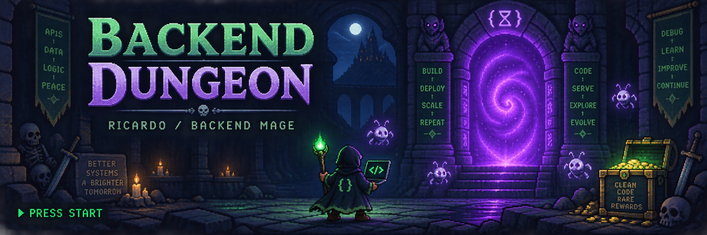

<div align="center">



<br />

**UN CHECKOUT HA FALLADO. TU AVENTURA COMIENZA.**

<sub>Un jugador. Demasiados módulos. Ninguna pista en el frontend.</sub>

<br /><br />

[ ▶ NUEVA PARTIDA ](#-player-one) · [ 🎒 INVENTARIO ](#-inventario) · [ 👾 BESTIARIO ](#-bestiario) · [ 💬 CO-OP ](#-campamento)

</div>

---

## 🧙 PLAYER ONE

**Ricardo** · Backend Mage · Servidor: Colombia

Construyo cosas con **PHP y Magento**. A veces cruzo el portal a **Salesforce**.  
Mi hábitat está entre una regla de negocio que parecía sencilla y el módulo que demuestra lo contrario.

> «Sí, ya limpié la caché. No, no era eso.»

```yaml
character:
  name: Ricardo
  class: Backend Mage
  main_world: Magento
  expansion: Salesforce
  alignment: chaotic_debug
  respawn_point: último commit estable
  final_boss: "En mi local funciona"
```

## 🎒 INVENTARIO

| Slot | Objeto equipado | Lore |
| :--- | :--- | :--- |
| ⚔️ Arma principal | **PHP** | Convierte reglas de negocio en hechizos ejecutables. |
| 🛡️ Armadura pesada | **Magento 2** | Gran poder. Muchas piezas. Algunas están en XML. |
| 🌀 Portal | **APIs · GraphQL** | Conecta reinos que no hablan el mismo idioma. |
| ☁️ Grimorio secundario | **Apex · Flow · LWC** | Magia aprendida al otro lado del portal Salesforce. |
| 🗝️ Llave del calabozo | **SQL · MySQL** | El dato existe. La pregunta es en qué tabla. |
| 🎒 Mochila dimensional | **Docker · Composer** | Lleva el entorno. Invoca las dependencias. |
| ⏳ Cristal de guardado | **Git** | Porque hasta los magos necesitan volver atrás. |

<details>
<summary>🧪 Inspeccionar objeto desconocido</summary>

### Poción de invalidación de caché

**Descripción:** promete revelar tus cambios.  
**Efecto secundario:** puedes empezar a usarla sin saber qué estás invalidando.

*El mercader no acepta devoluciones. El bug sí vuelve.*

</details>

## 👾 BESTIARIO

<sub>Haz clic en un enemigo para iniciar el encuentro.</sub>

<details>
<summary>👻 EL CRON FANTASMA · «Pero estaba programado…»</summary>

**Habilidad:** no aparecer cuando más lo necesitas.  
**Loot falso:** «Seguro se ejecuta en el próximo minuto».

**Movimiento del mago:** seguir las huellas en los logs y revisar la ejecución antes de invocar otro cron.

> No estaba muerto. Estaba pendiente.

</details>

<details>
<summary>🕷️ EL BUG INTERMITENTE · Solo aparece cuando nadie está mirando</summary>

**Habilidad:** desaparecer durante la demostración.  
**Resistencia:** capturas de pantalla sin contexto.

**Movimiento del mago:** reunir condiciones, entradas y evidencia hasta convertir «a veces» en una secuencia reproducible.

> Has equipado: paciencia. El enemigo ha equipado: concurrencia.

</details>

<details>
<summary>🧟 LA CACHÉ MALDITA · Conserva recuerdos de una versión anterior</summary>

**Habilidad:** hacerte dudar de tu propio commit.  
**Frase de combate:** «Ese texto ya lo cambié».

**Movimiento del mago:** descubrir qué capa sirve la respuesta y qué debería invalidarla.

> Limpiar todo es un hechizo. Entender por qué vuelve es la misión.

</details>

<details>
<summary>🐉 LA EXTENSIÓN ANCESTRAL · Boss de varias fases</summary>

**Fase 1:** instalar.  
**Fase 2:** configurar.  
**Fase 3:** descubrir la personalización que nadie documentó.  
**Fase secreta:** otra extensión modifica el mismo comportamiento.

**Movimiento del mago:** rastrear el flujo y localizar el punto de conflicto antes de lanzar una nueva sobrescritura.

> El verdadero boss eran las dependencias que hicimos por el camino.

</details>

## 📜 TABLÓN DE MISIONES

**Elige una ruta.** Son territorios de código, no una lista de logros desbloqueados.

- **⚒️ La forja de módulos** — darle forma a una regla de negocio sin convertirla en una maldición.
- **🌉 El puente entre reinos** — hacer que APIs, datos y sistemas se entiendan.
- **💎 El checkout perdido** — seguir el recorrido del pago hasta encontrar dónde se rompe la aventura.
- **☁️ Las islas de Salesforce** — explorar automatizaciones, Apex y componentes.

<sub>Los repositorios públicos del perfil son las puertas de entrada. No todos los cofres contienen proyectos terminados; algunos contienen preguntas interesantes.</sub>

## 🔥 CAMPAMENTO

Llegaste a la zona segura. Aquí se habla de código, ideas y bugs difíciles.

<details>
<summary>💬 Hablar con Ricardo</summary>

**Viajero:** ¿A qué te dedicas por estos reinos?  
**Ricardo:** Backend, módulos e integraciones. Principalmente Magento; también Salesforce.

**Viajero:** Tengo un problema raro.  
**Ricardo:** Perfecto. Empecemos por qué esperabas que pasara y qué pasó realmente.

**Viajero:** ¿Y si quiero proponer algo?  
**Ricardo:** [Abre el canal de comunicación](mailto:richar018990@hotmail.com).

</details>

<details>
<summary>🚪 No abrir. Definitivamente no hay un easter egg aquí.</summary>

### Has encontrado la sala secreta.

```diff
- Era un cambio de cinco minutos.
+ Se ha desbloqueado una nueva región del mapa.
```

**Objeto obtenido:** un ticket con mejor contexto.  
**Rareza:** legendaria.

</details>

<br />

<div align="center">

**[ ✉️ INVITAR A CO-OP ](mailto:richar018990@hotmail.com)**

<br />

*No hay bugs pequeños.*  
*Solo bosses que todavía no han mostrado su segunda fase.*

<sub>SAVE POINT REACHED · Puedes cerrar esta pestaña. La aventura continúa.</sub>

</div>
